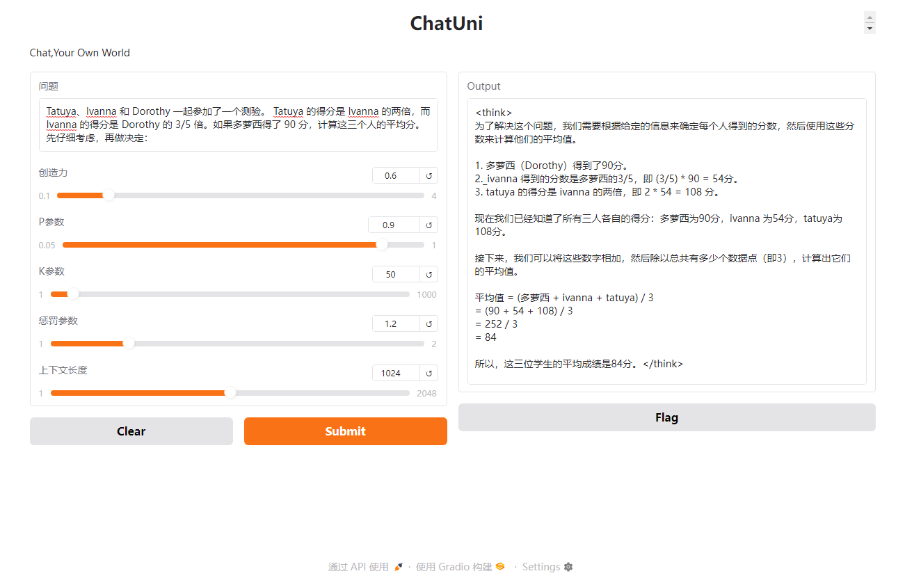
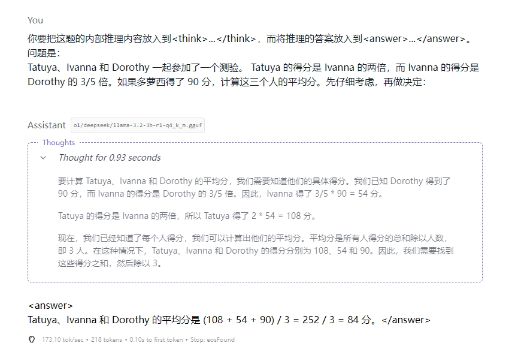

# R1-Nature 

本项目的出发点在于，在小模型上复现R1结果，通过比较性实验展示，包括不同思维推理CoT数据集，与不同尺寸的小模型（0.5B、1B、1.5B和3B），在微调效果上的差异。以相当简单的方式阐释，当前类O1和R1系统中，最重要的影响因素就是think的思维内部推理过程，这一点就是R1本质。同时，项目认为，仍然存在大量未能澄清的细节性问题，如思维链推理爆炸现象和解决方案，需要引起研究者足够重视，而不是简单的蒸馏+RL学习。

## 1.项目环境

Pytorch 2.3.0+ Cuda 12.1

Peft 0.14.0

transformers 4.48.2

LLAMACPP B4646 cuda12.4

RTX 4090 24G 显卡一张

128GB 内存，LMStudio 0.3.9

## 2.资源分享

数据集：https://huggingface.co/datasets/shareAI/Alpaca-Distill-R1-ZH

模型：

https://huggingface.co/StarRing2022/qwen2.5-0.5b-r1  （由qwen2.5 0.5b蒸馏微调）

https://huggingface.co/StarRing2022/llama3.2-1b-r1 （由llama3.2 1b蒸馏微调）

https://huggingface.co/StarRing2022/llama3.2-3b-r1 （由llama3.2 3b蒸馏微调）

https://huggingface.co/StarRing2022/qwen2.5-1.5b-r1 （由qwen2.5 1.5b蒸馏微调）

https://huggingface.co/StarRing2022/deepqwen2.5-1.5b-r1 （由deepseek官方发布的qwen2.5 1.5b蒸馏微调）

https://huggingface.co/StarRing2022/R1-Alpaca-Lora  (各实验模型的lora权值)

GGUF模型：

https://huggingface.co/shareAI/qwen2.5-0.5b-r1-GGUF （FP16）

https://huggingface.co/shareAI/llama3.2-1b-r1-GGUF （Q4 K_M）

https://huggingface.co/shareAI/llama3.2-3b-r1-GGUF （Q4 K_M）

## 3.数据集介绍

ringo1-CoT_demo.json，大约0.1K条数据，英文为主，混合中文，原始数据集来源于Marco-o1（https://github.com/AIDC-AI/Marco-o1）, 用于微调的尝试，1B模型+单卡4090训练1轮仅需数分钟即可，修改格式标签为<think>...</think>或更贴近于编程含义的<thinkbegin>...</thinkend>，去掉原有的<output>...</output>，发现这种思维性质的标签，会产生很大影响

openr1-SFT.json，由jsonl转化，大约160K条数据，中英文混杂，原始数据集来源于OpenO1（https://huggingface.co/datasets/O1-OPEN/OpenO1-SFT ），标签格式为<think>...</think>和<answer>...</answer>，1B模型+单卡4090需要训练1轮约35h时长

magpie-r1.json，由parquet转化，大约10K条数据，全英文，且思维链内容较长，原始数据集来源于Magpie（https://huggingface.co/datasets/LangAGI-Lab/magpie-reasoning-v1-10k-step-by-step-rationale-alpaca-format），1B模型+单卡4090需要训练1轮约30min时长


项目使用的alpaca数据集的基础语料来源于 alpaca_gpt4_data_zh.json, 原50K条数据

tiny_alpaca_XXX仅有约20条数据，为了初步观察与评估蒸馏目标模型的推理差异

tiny_alpaca_zh-distill-o3.json 蒸馏O3-MINI，没有<think>等标签，仍为 > Reasoning

tiny_alpaca_zh-distill-gpt4o.json 蒸馏GPT-4o，使用提示工程获得答案，标签格式为<think>...</think>和<answer>...</answer>

tiny_alpaca_zh-distill-local.json 由本地DeepSeek发布的qwen 2.5 7B蒸馏得到，标签格式仅有<think>...</think>，而没有答案标签


项目主要微调使用的语料，经实测，对于同一模型，由本地DeepSeek发布的qwen 2.5 7B蒸馏得到的数据集，在LOSS表现上，确不及云端如GPT4o得到的数据，loss差值可达到0.4（范围为0.8-1.2）

alpaca_r1_data_zh-remote.json 来源于云端，纯中文，约alpaca前2.6K条数据，训练的主要测试数据，要注意的是，我们将input内容直接去掉，而没有进行拼接到instrcution，目的是取得mask类似效果，增强模型的猜测能力，1B模型+单卡4090需要训练1轮约8min时长

alpaca_r1_data_zh-localpost.json 来源本地，纯中文，约alpaca前2K条数据，不一样在于，由DeepSeek蒸馏内容是不带<answer>答案标签的，我们发现，如果提示工程去强制标注，是无法像gpt4o那样得到带<answer>标注数据，反而会使<think>也混乱，因而Prompt尤其是System Prompt Rule理应存在且很重要。我们的处理，就是使用字符串匹配，带上<answer>...</answer>标签，用于训练。1B模型+单卡4090需要训练1轮约8min时长

## 3.代码结构介绍

jsonl2json.py 将jsonl转为R1 微调所需要的json格式，标签格式为<think>...</think>和<answer>...</answer>

parquet2json.py 将parquet转为R1 微调所需要的json格式，标签格式为<think>...</think>和<answer>...</answer>

distillationgalpacalocal.py 使用搭建在LMStudio的本地模型得到蒸馏数据

deallocaldistil.py 如果本地使用的是DeepSeek R1的模型，则输出数据和所需要的训练数据格式不统一（如前文提及，这里值得探究），后处理为带<answer>数据

distillationgalpacaremote.py 利用Prompt，使用云端大模型得到所需要的蒸馏数据

finetuneSFTR1.py 使用SFT Lora微调，利用trl库的SFTraniner，默认Lora微调7个模块，CTX为1024，可持续做2-3个阶段

```json
 "target_modules": [
        "q_proj",
        "o_proj",
        "up_proj",
        "k_proj",
        "down_proj",
        "v_proj",
        "gate_proj"
    ],
```

```python
    output_dir: str = "./lora-out",
    batch_size: int = 5,
    micro_batch_size: int = 4,
    num_epochs: int = 1,
    learning_rate: float = 3e-4,
    cutoff_len: int = 1024,
    val_set_size: int = 1,
    lora_r: int = 8,
    lora_alpha: int = 16,
    lora_dropout: float = 0.05,
```

generatefinetune.py 搭建简单的gradio测试微调后的模型

demo.py 测试分享的模型

### 部分对话效果展示：

```
一个很好的问题！爱因斯坦质方程是一种量子力学方程，用于描述粒子和量子系统的行为。让我们一步一步地分析一下。

爱因斯坦质方程是由Albert Einstein、Niels Bohr和Erwin Schrödinger在 1924 年首次提出。该方程描述了量子系统中粒子和量子系统的相互作用，包括相互作用的方向和强度。以下是一些爱因斯坦质方程：

1. 最初方程 (1)：在量子系统中，粒子和量子系统的相互作用是通过电磁场来实现的。该方程描述了粒子和量子系统的相互作用，包括相互作用的方向和强度。

∇⋅(E⋅ψ) = -ℏ(∂/∂tψ)

其中，E是电荷的力，ψ是粒子的 wave function，ℏ是量子波数，t是时间。

2. 最初方程 (2)：在量子系统中，粒子和量子系统的相互作用是通过量子力来实现的。该方程描述了粒子和量子系统的相互作用，包括相互作用的方向和强度。

Hψ = Eψ

其中，H是量子力矩阵，ψ是粒子的 wave function，E是粒子的能量。

3. 磁性量子力方程 (3)：在量子系统中，粒子和量子系统的相互作用是通过磁场来实现的。该方程描述了粒子和量子系统的相互作用，包括相互作用的方向和强度。

ℋ⋅ψ = -iℏ(∂/∂tψ)

其中，ℋ是磁场力矩阵，ψ是粒子的 wave function，i是虚数单位，ℏ是量子波数。

这些方程是爱因斯坦质方程的一部分，描述了量子系统中粒子和量子系统的相互作用。这些方程是量子力学中的基本方程，形象地描述了量子系统的相互作用。

爱因斯坦质方程是量子力学中的基本方程，形象地描述了量子系统的相互作用。这些方程是量子力学中的基本方程，形象地描述了量子系统的相互作用。
```




## 4.思维链推理爆炸现象的产生原因与解决方案

我们已经观察到，由于强推理的存在，模型在获得这个能力后，也会相应带来推理速度变慢，更棘手的是，思维链推理的内容有时看似进入死循环，对max_length设为1024，推理内容竟然达到8K字以上，显然，这种推理是失败的，反复纠结，南辕北辙，得不到答案，更得不出正确答案。这种现象，我们称之为 思维链推理爆炸。观察O3、GPT4o等模型，成功的数学解题案例中，推理内容鲜有超过2048，对于思维链推理的内容广度、长度必然应存在控制性策略。

### 产生原因（复现）：

当我们选择待微调的模型为llama 3.2 1B时，数据集选择magie_10k，重复SFT Lora所有模型层 3-5轮，会容易触发这种现象，微调后的模型会一直推理下去，越推理越远。可见，当模型参数较小，数据集思维内容又长但量级不高，训练强度过深，则会发生类似问题。

### 可能的解决方案：

（1）grop step func reward。通过奖励去固定或控制微调的think方向与内容

（2）冻结LLM部分层训练。我们认为这种方式最简易可行，但未必效果最优。RL强化似乎更多地指向，这种策略适合于对关键层操作，而对“酱油层”放弃。如只微调 q\k模块，训练论数仅1-2次，但这会带来另一个问题，假如数据量不多，微调后的模型输出格式是无法完全保持一致且理想的

（3）采用之前的智能体prompt技术，去操控思维整体过程

（4）ZeroCoT随机插值CoT（https://github.com/Beortext/RWKV-ZeroCoT），也是参考性的相关思路，因为问题根本原因仍出在think标签涵盖的内容，被如“酱油层”过分展开

（5）区分不同阶段的数据集，其特点、量级和质量作提升

## 5.结论

#### 5.1 思考内容Think为核心，其次是整个CoT强推理的结构化，再次则是微调策略、训练配置、训练强度等

#### 5.2 Prompt的规则设计依然很必要

#### 5.3 标签是目前最被忽视的事项，但越来越多的实验证明，format形式和think内容有着更复杂的制约关系，还承待我们去发现验证

总之，并非如我们看到的，蒸馏高质量数据结合多阶段RL学习，即可以得到近乎完美的产物，很多细节性因素值得业内研究者更多的关注。另外，R1微调主要依靠多阶段强化学习，本项目之所以采用SFT，仍是考虑快速、便捷、易懂地呈现一些崭新的实验成果。

## 6.未来发展

我们也发现，对于1B和0.5B的模型，确实出现了令人惊喜的推理、回溯分析等能力，即使这些能力的涌现未能帮助模型解题成功，但仍有一定程度上的价值。后续计划在RWKV7 0.1B甚至更小参数的模式，诞生出推理的痕迹。
